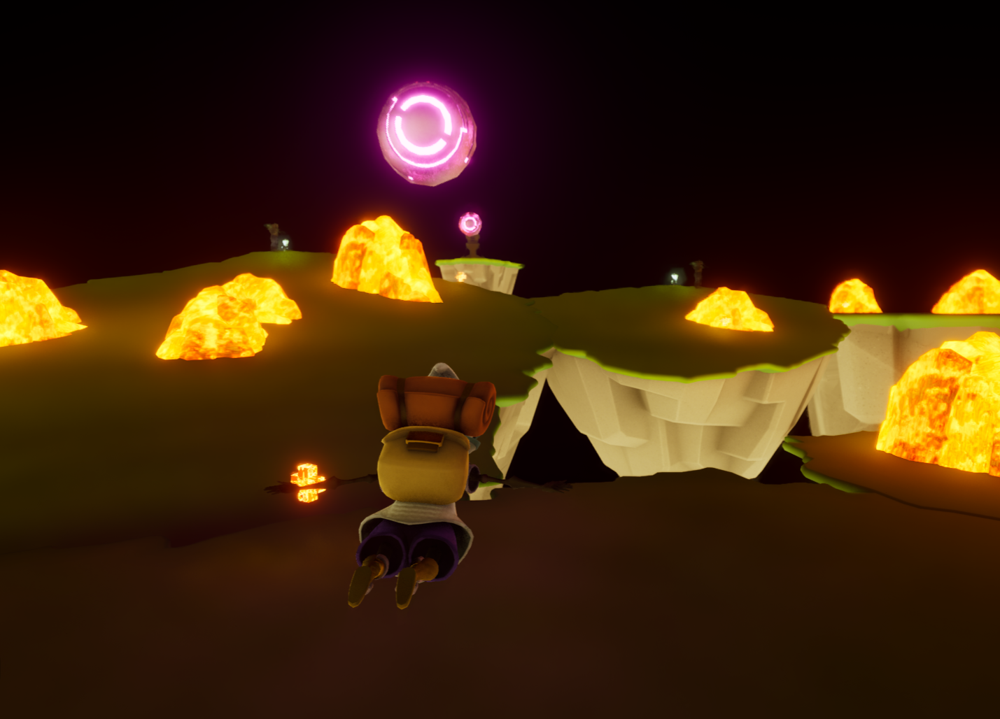
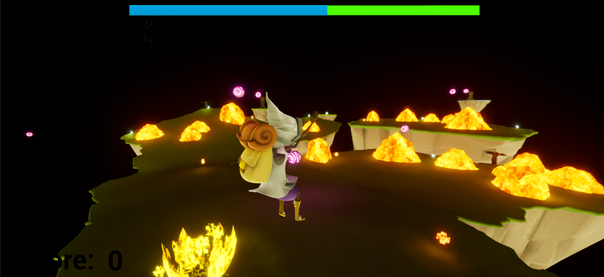
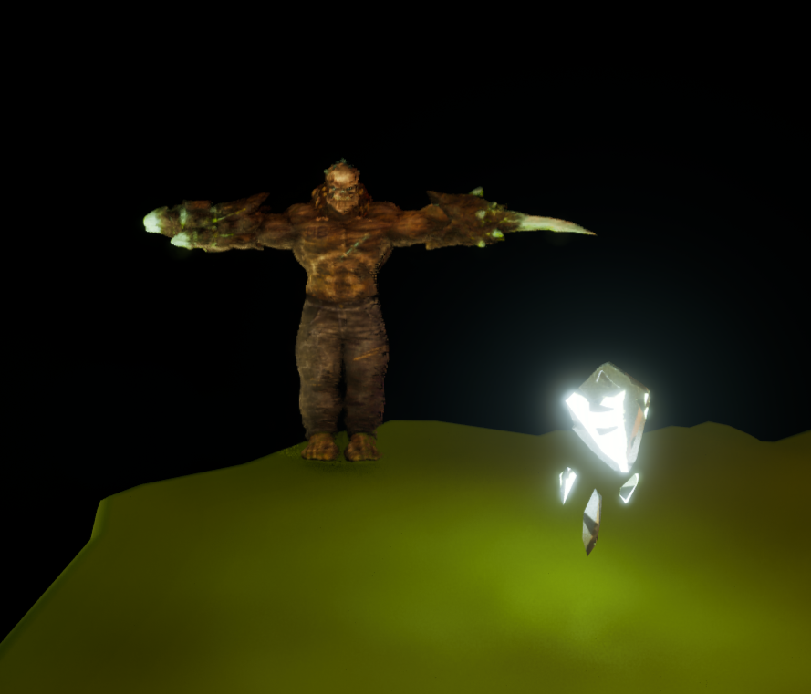
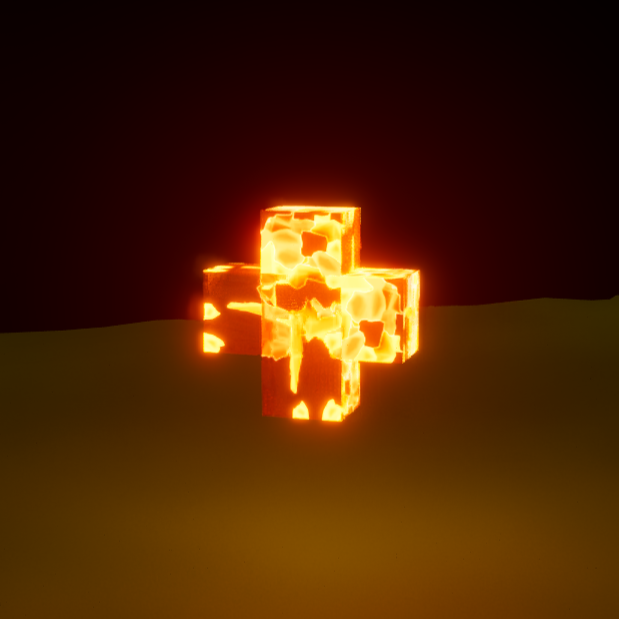
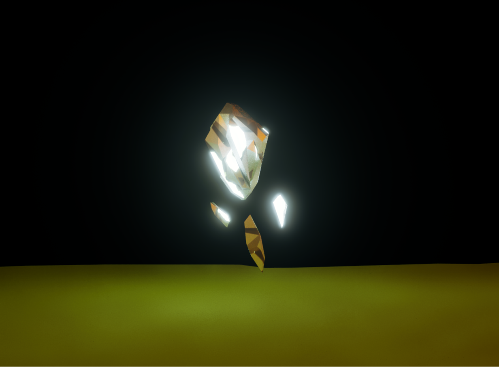

# Shardstorm 🔥

**Shardstorm** is a fast-paced, third-person survival platformer where players must collect gems while dodging falling cannonballs, hostile enemies, and an aggressive boss in a dark, lava-themed world.

**NOTE: Executable can be found under /Windows**
---

## 🎮 Gameplay Overview

- **Objective:**  
  Survive waves of swarming enemies and environmental hazards while collecting gems to win the level.

- **Core Mechanics:**
  - Third-person movement with **dash** and **stomp** abilities.
  - Use **Left Click** to drop delayed-detonation bombs.
  - **Dash** with Left Shift to escape danger or reposition quickly.
  - **Stomp** enemies with 'F' to deal radial damage and apply impulse.
  - Avoid falling cannonballs and enemy swarms.
  - Recover stamina to perform special actions.
  - Constantly moving, reflex-heavy gameplay loop.
---

## 🧱 Features

- **Swarm-based AI** enemies (android ad-style wave mechanic).
- **Improved stomp mechanic** with real impulse and visual feedback.
- **New stamina system** that powers dash and stomp moves.
- **Shooting mechanic**: Drop bombs with Left Click that explode after 3 seconds.
- **Enemies now have health**, requiring multiple attacks.
- **Updated UI**: White score display, stamina (energy) bar added.
- **Quicker movement** and **recovery from hits** for fluid pacing.
- **Bug fix**: Player no longer moves after death.
- **Bug fix #2**: Successful Packaging for Windows.
---

## 📸 Screenshots

> Add screenshots or GIFs here once gameplay visuals are ready.

## 🧩 Controls

| Action        | Key/Mouse        |
|---------------|------------------|
| Move          | WASD             |
| Dash          | Left Shift       |
| Jump          | Space            |
| Stomp         | F                |
| Drop Bomb     | Left Click       |

---

## 🔧 Built With Unreal Engine 5.3.2

---

## 🚧 Roadmap

- [x] **Core Combat System:** Fluid movement with precise controls, including sprinting, dashing, and responsive directional inputs.  
- [x] **Enemy Waves:** Dynamic enemy spawner for continuous waves, keeping pressure on the player throughout the level.  
- [x] **Boss Fight Mechanics:** Final boss revamp with ranged attacks, area-of-effect abilities, and multiple health phases for a challenging endgame encounter.  
- [x] **Stamina System:** Balanced stamina consumption for dashing and stomping, encouraging aggressive but tactical play.  
- [x] **Improved Stomp Mechanic:** Proper radial damage, impulse knockback, and visual feedback for satisfying crowd control.  
- [x] **Bomb Attack Mechanic:** Use Left Click to drop delayed-detonation bombs with real-time area damage.  
- [x] **Enhanced Player Feedback:** Quicker recovery from radial hits and reduced stun time for fluid, high-speed combat.  
- [x] **Sound Design Overhaul:** Custom sound effects for player actions (dash, stomp, bomb) and ambient sounds for immersive gameplay.  
- [x] **UI Enhancements:** Clean score display, added stamina bar, and better visual cues for player health and energy.  
- [x] **Revamped HUD:** Clearer UI elements for player health, stamina, and remaining gem count.  
- [x] **Polished Level Design:** Refined arena with better hazard placement and smoother player navigation paths.  
- [x] **Player Death Fix:** Resolved issue where the player continued moving post-death.  
- [x] **Enemy Health System:** Enemies now have health, requiring multiple attacks for elimination.  
- [x] **Physics Improvements:** Enhanced player knockback, smoother stomp physics, and realistic enemy ragdolls.  
- [x] **SFX Integration:** Added sound effects for all core interactions, including gem collection and enemy hits.  
- [x] **Final Boss Intro Cutscene:** Added brief animation and sound effects for a more cinematic boss encounter.  
- [x] **Explosion and Impact Effects:** Polished VFX for stomp, bomb explosions, and enemy deaths.  
- [x] **Menu and Settings:** Basic main menu with start and exit buttons for a cleaner user experience.  
- [x] **Gameplay Balancing:** Tweaked enemy speed, health, and damage to match the fast-paced style of the game.  
- [x] **Enemy Variety:** Introduced different enemy types for varied combat encounters.  
- [x] **Improved Respawn System:** Fixed bugs with the respawn button and player health reset.
- [x] **Community Playtest and Feedback Round:** Gather player feedback for final polish before full release.  
- [ ] **Colorblind Accessibility:** Integrate colorblindness filters for improved visual accessibility (in progress).  
- [ ] **Advanced Audio Mixing:** Final pass on volume levels, sound panning, and spatial effects for more immersive audio.  
- [ ] **Polished Animations:** Smooth out player and enemy animations for a more cohesive visual experience.  
- [ ] **Post-Processing Effects:** Add motion blur, depth of field, and ambient occlusion for a more cinematic look.  
- [ ] **Final Bug Fixing and Optimization:** Final pass to eliminate frame drops and minor collision issues.  
- [ ] **Game Packaging and Build Testing:** Finalize build for cross-platform testing and distribution.  
- [ ] **Launch Trailer and Marketing Assets:** Create promotional materials for game launch.  
- [ ] **Final Release and Launch Prep:** Prepare for full release, including storefront setup and press outreach.  

---
