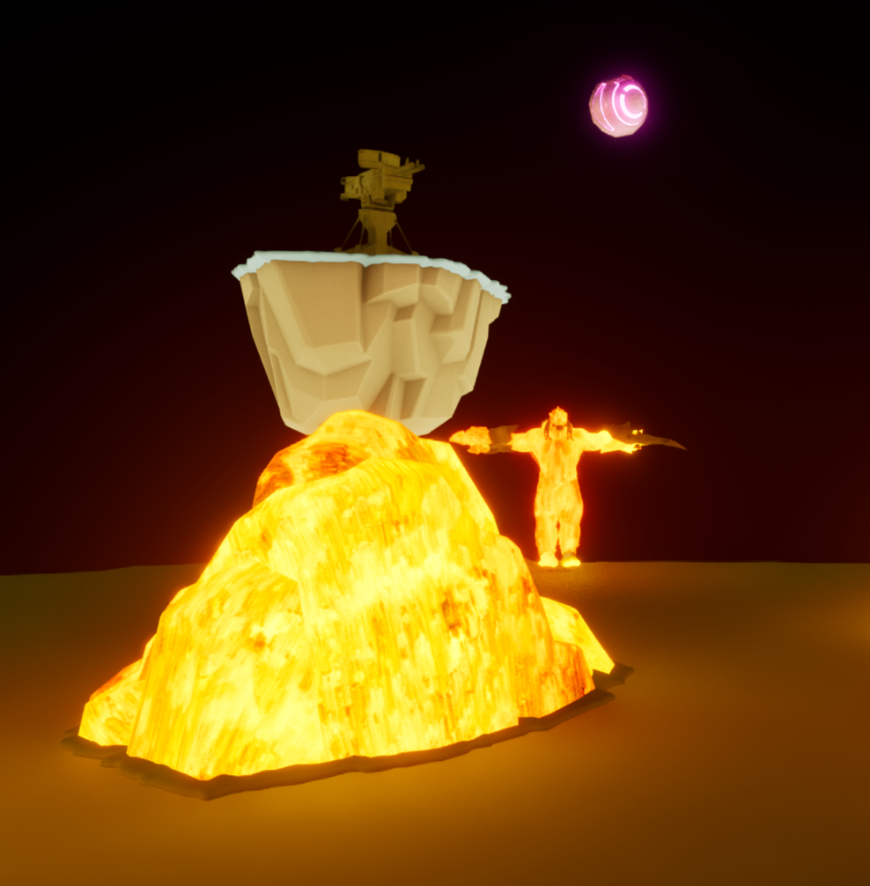

# Shardstorm 🔥

**Shardstorm** is a fast-paced, third-person survival platformer where players must collect gems while dodging falling cannonballs, hostile enemies, and an aggressive boss in a dark, lava-themed world.

**NOTE: Executable can be found under /Windows**
---

## 🎮 Gameplay Overview

- **Objective:**  
  Survive waves of swarming enemies and environmental hazards while collecting gems to win the level.

- **Core Mechanics:**
  - Third-person movement with **dash** and **stomp** abilities.
  - Use **Left Click** to drop delayed-detonation bombs.
  - **Dash** with Left Shift to escape danger or reposition quickly.
  - **Stomp** enemies with 'F' to deal radial damage and apply impulse.
  - Avoid falling cannonballs and enemy swarms.
  - Recover stamina to perform special actions.
  - Constantly moving, reflex-heavy gameplay loop.
---

## 🧱 Features

- **Swarm-based AI** enemies (android ad-style wave mechanic).
- **Improved stomp mechanic** with real impulse and visual feedback.
- **New stamina system** that powers dash and stomp moves.
- **Shooting mechanic**: Drop bombs with Left Click that explode after 3 seconds.
- **Enemies now have health**, requiring multiple attacks.
- **Updated UI**: White score display, stamina (energy) bar added.
- **Quicker movement** and **recovery from hits** for fluid pacing.
- **Bug fix**: Player no longer moves after death.
- **Bug fix #2**: Successful Packaging for Windows.
---

## 📸 Screenshots

> Add screenshots or GIFs here once gameplay visuals are ready.

## 🧩 Controls

| Action        | Key/Mouse        |
|---------------|------------------|
| Move          | WASD             |
| Dash          | Left Shift       |
| Jump          | Space            |
| Stomp         | F                |
| Drop Bomb     | Left Click       |

---

## 🔧 Built With Unreal Engine 5.3.2

---

## 🚧 Roadmap

- [x] Core prototype with level, enemies, gems, and health
- [x] Add delayed bomb shooting mechanic (Left Click)
- [x] Additional enemy types with health and spawn logic
- [x] Dash and stamina systems for more mobility
- [x] Improved stomp and enemy interaction
- [x] Faster player recovery for smoother pacing
- [ ] Main enemy overhaul (new design, more spawns)
- [ ] Polish respawn button functionality
- [ ] Sound effects & UI/audio asset syncing
- [ ] Menu UI and pause system

---
